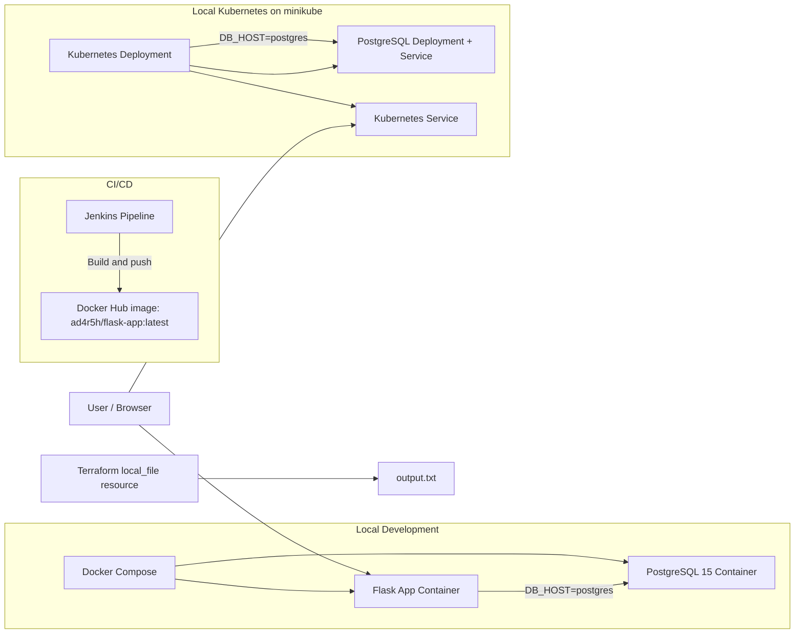

# TW2 - Advanced DevOps Practices

Flask + PostgreSQL + Docker Compose + Kubernetes + Jenkins + Terraform

## Project Overview

This project demonstrates a complete local DevOps workflow for a Flask application backed by PostgreSQL. The repository includes:

- A Flask application that connects to PostgreSQL through environment variables.
- A Docker Compose setup for running Flask and PostgreSQL together.
- Kubernetes manifests for deploying the application and database on minikube.
- A Jenkins pipeline that builds and pushes the Flask image to Docker Hub.
- A Terraform configuration that creates a local `output.txt` file as IaC output.

The implementation is intentionally simple and matches the files in this repository exactly.

## Architecture Diagram



## Technologies Used

| Technology | Purpose |
| --- | --- |
| Flask | Web application framework |
| psycopg2-binary | PostgreSQL driver used by Flask |
| PostgreSQL 15 | Database backend |
| Docker | Containerization |
| Docker Compose | Multi-container local orchestration |
| Kubernetes | Container orchestration on minikube |
| kubectl | Kubernetes CLI |
| minikube | Local Kubernetes cluster |
| Jenkins | CI/CD pipeline |
| Docker Hub | Image registry |
| Terraform | Infrastructure as Code |

## Folder Structure

```text
Assignment-TW2-Advanced-DevOps/
├── app/
│   ├── app.py
│   ├── Dockerfile
│   └── requirements.txt
├── k8s/
│   ├── deployment.yaml
│   ├── service.yaml
│   ├── postgres-deployment.yaml
│   └── postgres-service.yaml
├── terraform/
│   ├── main.tf
│   ├── output.txt
│   ├── terraform.tfstate
│   └── .terraform.lock.hcl
├── Screenshots/
├── docker-compose.yml
├── Jenkinsfile
└── README.md
```

## Step-by-Step Implementation

### 1. Flask Application and PostgreSQL Integration

The Flask application in `app/app.py` connects to PostgreSQL using these environment variables:

- `DB_HOST`
- `DB_NAME`
- `DB_USER`
- `DB_PASSWORD`

On every request to `/`, the app:

1. Opens a PostgreSQL connection using `psycopg2`.
2. Creates the `messages` table if it does not exist.
3. Inserts the message `Hello from Flask and PostgreSQL`.
4. Returns the response `Flask Connected Successfully With PostgreSQL`.

This is how Flask communicates with PostgreSQL in both Docker Compose and Kubernetes.

### Screenshot: Flask PostgreSQL connection in the browser


### 2. Docker Compose Multi-Container Setup

The `docker-compose.yml` file defines two services:

- `flask-app` is built from `./app` and exposes port `5000:5000`.
- `postgres` uses the `postgres:15` image and exposes port `5432:5432`.

Networking is handled by the default Compose network. The Flask container reaches PostgreSQL using the service name `postgres`, which matches `DB_HOST=postgres` in the Compose environment block.

Relevant commands:

```bash
docker compose up
docker compose ps
```

### Screenshot: Docker Compose stack running


## 3. Kubernetes Deployment and Service

### 3.1 Image Availability

The Kubernetes deployment uses the Docker Hub image `ad4r5h/flask-app:latest`. The image is built in Jenkins, pushed to Docker Hub, and then pulled by Kubernetes.

### 3.2 Deployment YAML

The file `k8s/deployment.yaml` defines the Flask deployment with the following implementation details:

- `replicas: 2`
- container image: `ad4r5h/flask-app:latest`
- container port: `5000`
- `imagePullPolicy: Always`
- environment variables:
  - `DB_HOST=postgres`
  - `DB_NAME=testdb`
  - `DB_USER=admin`
  - `DB_PASSWORD=password`

The manifest also includes CPU and memory requests/limits.

Deployment command:

```bash
kubectl apply -f k8s/deployment.yaml
kubectl get pods
```

### Screenshot: Kubernetes pods running successfully


### 3.3 Service YAML

The file `k8s/service.yaml` exposes the Flask deployment as a `NodePort` service:

- service type: `NodePort`
- port: `5000`
- targetPort: `5000`
- nodePort: `30001`

Access command:

```bash
minikube service flask-service
```

### Screenshot: Flask application exposed through minikube service


## 4. Jenkins CI/CD Pipeline

The `Jenkinsfile` contains a declarative pipeline with these stages:

1. `Checkout` - pulls the source using `checkout scm`.
2. `Build Docker Image` - builds `ad4r5h/flask-app:latest` from `./app`.
3. `Push Docker Image` - authenticates to Docker Hub using Jenkins credentials and pushes the image.

Important implementation detail: Docker Hub login is done inside the push stage using `withCredentials` and `docker login`; it is not a separate stage in the Jenkinsfile.

### Screenshot: Jenkins build success


## 5. Terraform Infrastructure as Code

The Terraform configuration in `terraform/main.tf` uses the `hashicorp/local` provider to create a local file resource.

Terraform purpose in this project:

- create `output.txt` locally
- store a short IaC completion message for the assignment

The generated file content is visible in `terraform/output.txt` and states that the Terraform IaC task was completed successfully.

Commands used:

```bash
terraform init
terraform plan
terraform apply
```

### Screenshot: Terraform init


### Screenshot: Terraform plan and successful apply


### Screenshot: Generated output.txt file


## Commands Summary

```bash
# Docker Compose
docker compose up
docker compose ps

# Kubernetes
kubectl apply -f k8s/deployment.yaml
kubectl get pods
kubectl apply -f k8s/service.yaml
minikube service flask-service

# Terraform
terraform init
terraform plan
terraform apply
```

## Conclusion

This repository implements the TW2 Advanced DevOps workflow end to end:

- Flask connects to PostgreSQL through environment variables.
- Docker Compose runs the application and database locally.
- Kubernetes deploys the same image on minikube with a NodePort service.
- Jenkins builds and pushes the Docker image to Docker Hub.
- Terraform creates a local output file as the IaC deliverable.

The README and screenshots are mapped directly to the assignment marking scheme and reflect the actual implementation in this repository.
