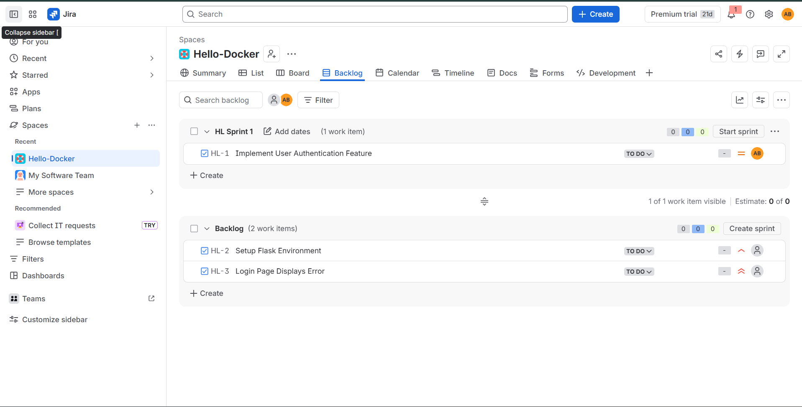
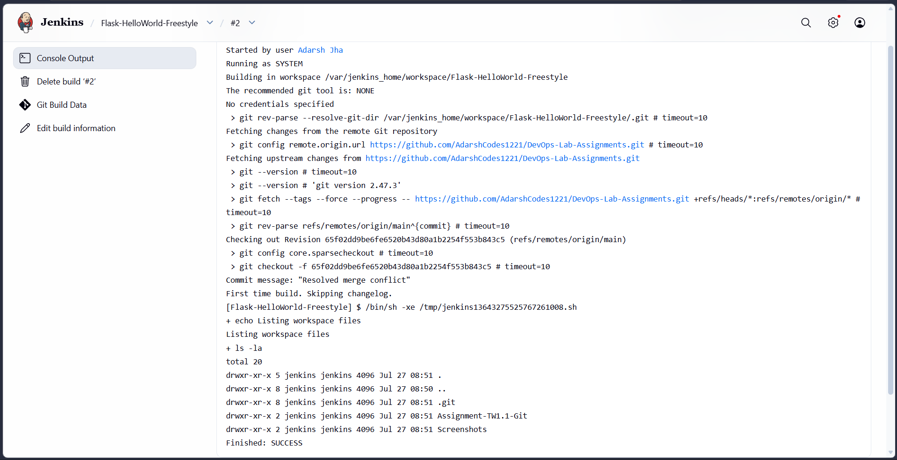

# 🚀 DevOps Laboratory Assignments

## Student Information

- **Name:** Adarsh Jha
- **Course:** DevOps Laboratory
- **Branch: ** CSE 
- **PRN:** 23070122261

## Repository Structure
```
DevOps-Lab-Assignments/
├── Assignment-TW1.1-Git
├── Assignment-TW1.2-Jira
├── Assignment-TW1.3Docker-Jenkins
├── Project-1-Dockerizing-Jenkins-Pipeline
├── Project-2-React-Docker
├── Project-Distributed-Jenkins
└── README.md
```


---

# Assignment TW1.1 – Git Workflow & Collaboration

## Objective
Learn Git fundamentals including branching, merging, GitHub collaboration and conflict resolution.


<details>
<summary><b>📸 Execution Screenshots (Click to Expand)</b></summary>


</details>


---

# Assignment TW1.2 – Jira Project & Issue Tracking

## Objective
Create and manage a Jira project, issues and workflows.


<details>
<summary><b>📸 Execution Screenshots (Click to Expand)</b></summary>




</details>


---

# Assignment TW1.3 – Docker & Jenkins Freestyle Project

## Objective
Containerize an application with Docker and automate builds using Jenkins Freestyle.


<details>
<summary><b>📸 Execution Screenshots (Click to Expand)</b></summary>




</details>


---

# Project 1 – Dockerizing Jenkins Pipeline

## Objective
Run a Jenkins pipeline inside Docker using Maven.


<details>
<summary><b>📸 Execution Screenshots (Click to Expand)</b></summary>


</details>


---

# Project 2 – React Docker Deployment

## Objective
Containerize and deploy a React application with Docker.


<details>
<summary><b>📸 Execution Screenshots (Click to Expand)</b></summary>


</details>


---

# Project 4 – Distributed Jenkins Pipeline

## Objective
Execute a distributed Jenkins pipeline using multiple Docker agents.


<details>
<summary><b>📸 Execution Screenshots (Click to Expand)</b></summary>


</details>


---

# Technologies Used

- Git
- GitHub
- Jira
- Docker
- Jenkins
- Maven
- Java
- React
- Node.js

---

# Learning Outcomes

- Git branching and collaboration
- Merge conflict resolution
- Jira project management
- Docker image creation and containers
- Jenkins Freestyle Jobs
- Jenkins Pipelines
- Distributed Jenkins builds
- CI/CD concepts
- Maven build automation

---

# Conclusion

This repository contains all DevOps laboratory assignments and projects completed during the course. It demonstrates practical skills in version control, project management, containerization, build automation, and continuous integration using industry-standard DevOps tools.

---

<div align="center">

## 👨‍💻 Author

**Adarsh Jha**

</div>
